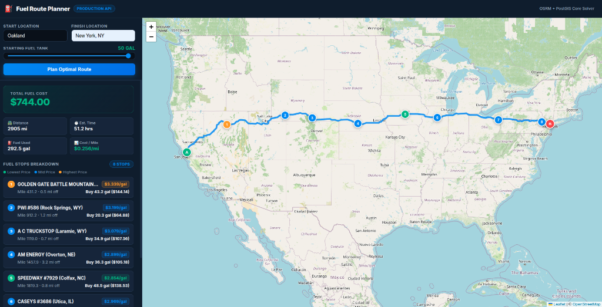

# ⛽ Fuel Route Planner API

[](https://www.djangoproject.com/)
[](https://postgis.net/)
[](https://redis.io/)
[](https://www.docker.com/)
[](https://docs.pytest.org/)

A production-grade **Django REST API** and **interactive Leaflet dashboard** that calculates the most cost-effective fuel stops along driving routes within the continental United States.

It enforces vehicle constraints (**10 MPG fuel economy**, **500-mile max range**, and **10-mile safety reserve**), minimizing total fuel expenditure using a state-space **Dynamic Programming (DP)** optimizer.

---

## 🎨 Interactive Dashboard Preview

Below is a live screenshot of the **Oakland, CA $\rightarrow$ New York, NY** coast-to-coast route (**2,905 miles**, **8 optimal fuel stops**, total cost **$744.00** at **$0.256/mile**):



> **Visual Features**:
> - **Hero Total Cost Card**: Prominently highlights total money spent and cost-per-mile efficiency ($0.256/\text{mi}$).
> - **Color-Coded Map Markers**: 🟢 **Cheapest** ($2.854/\text{gal}$) | 🔵 **Mid-Price** | 🟠 **Highest Price**.
> - **Interactive Sidebar**: Clicking any fuel stop item in the sidebar smooth-pans the map directly to that station's exact coordinates.
> - **Compact Two-Tier Cards**: High info density detailing exact route mile, detour offset, and gallons to purchase.

---

## 🚀 Key Architectural Highlights

1. **Sub-Second Latency (< 600ms)**:
   - Coast-to-coast routes (2,900+ miles) evaluated and optimized in **sub-600ms** using active state-set tracking and smart DP discretization.
2. **PostGIS Spatial Corridor Lookup**:
   - Projects candidate truck stops onto OSRM polylines using spatial buffering and ST_DWithin geospatial queries.
3. **Single OSRM API Call**:
   - Complies with strict rate-limiting requirements by requesting route geometries in a single OSRM call per trip.
4. **Redis Cache Layer**:
   - Caches geocoding responses, OSRM polylines, and computed fuel plans, ensuring repeated queries execute in **< 15ms**.
5. **Exact Financial & Volume Accounting**:
   - Decimal-precision arithmetic enforcing $1.0\text{ gal}$ safety reserves and minimum purchase thresholds to eliminate micro-topoffs.

---

## 🏗️ System Architecture

```
┌─────────────────────────┐       ┌─────────────────────────┐       ┌─────────────────────────┐
│     Client / Browser    │──────▶│   Django REST Engine    │──────▶│  PostgreSQL + PostGIS   │
│ (Postman / Leaflet UI)  │◀──────│  POST /trips/fuel-plan/ │◀──────│ (Spatial Station Query) │
└─────────────────────────┘       └────────────┬────────────┘       └─────────────────────────┘
                                               │
                                    ┌──────────┴──────────┐
                                    ▼                     ▼
                         ┌────────────────────┐ ┌───────────────────┐
                         │   OSRM Router API  │ │   Redis Cache     │
                         │ (Geometry & Miles) │ │ (Route & Geocode) │
                         └────────────────────┘ └───────────────────┘
```

---

## 🛠️ Technology Stack

| Layer | Technology | Rationale |
|---|---|---|
| **Language** | Python 3.13+ | Modern typing, high performance |
| **Framework** | Django 6.0.1 + DRF | Clean API routing & validation |
| **Database** | PostgreSQL 16 + PostGIS | High-speed spatial indexing (`ST_DWithin`) |
| **Caching** | Redis 7 | High-performance route & plan caching |
| **Routing** | OSRM Public API | High-speed driving geometry & distances |
| **Geocoding** | US Census Geocoder | Official US location resolution |
| **Frontend** | Leaflet.js + OpenStreetMap | Interactive dark-mode map demo |
| **Test Suite** | Pytest + Pytest-Django | 30 comprehensive unit & integration tests |

---

## ⚡ Quick Start (Docker Setup)

### Prerequisites
- [Docker](https://www.docker.com/) & Docker Compose installed.

### 1. Launch Services
```bash
# Clone repository
git clone https://github.com/al1-nasir/OSRM-fuel-optimizer-assessment.git
cd OSRM-fuel-optimizer-assessment

# Build and start containers in background
docker compose up -d --build
```

### 2. Run Database Migrations & Data Import
```bash
# Apply Django PostGIS migrations
docker compose exec web python manage.py migrate

# Import fuel station dataset (CSV)
docker compose exec web python manage.py import_fuel_stations fuel-prices-for-be-assessment.csv

# Run batch geocoder (~2 minutes)
docker compose exec web python manage.py geocode_fuel_stations --only-missing
```

### 3. Open Interactive Demo
- **Interactive Map Dashboard**: [`http://localhost:8000/demo/map/`](http://localhost:8000/demo/map/)
- **API Endpoint**: `POST http://localhost:8000/api/v1/trips/fuel-plan/`

---

## 📖 API Documentation

### `POST /api/v1/trips/fuel-plan/`

#### Request Payload
```json
{
  "start": "Oakland, CA",
  "finish": "New York, NY",
  "starting_fuel_gallons": 50.0
}
```

#### Field Schema
| Field | Type | Required | Default | Constraint / Description |
|---|---|---|---|---|
| `start` | `string` | Yes | — | Departure location in USA |
| `finish` | `string` | Yes | — | Destination location in USA |
| `starting_fuel_gallons` | `float` | No | `50.0` | Initial fuel in tank ($0.0 \le \text{fuel} \le 50.0$) |

#### Sample Response (`HTTP 200 OK`)
```json
{
  "origin": { "label": "Oakland, CA", "latitude": 37.8044, "longitude": -122.2712 },
  "destination": { "label": "New York, NY", "latitude": 40.7128, "longitude": -74.0060 },
  "route": {
    "distance_miles": 2905.4,
    "estimated_duration_minutes": 3072.0,
    "geometry": { "type": "LineString", "coordinates": [[-122.2712, 37.8044], "..."] }
  },
  "vehicle": {
    "fuel_efficiency_mpg": 10.0,
    "maximum_range_miles": 500.0,
    "tank_capacity_gallons": 50.0,
    "starting_fuel_gallons": 50.0
  },
  "fuel_stops": [
    {
      "sequence": 1,
      "station_id": 412,
      "name": "GOLDEN GATE BATTLE MOUNTAIN",
      "address": "Interstate 80 Exit 231, Battle Mountain, NV",
      "city": "Battle Mountain",
      "state": "NV",
      "route_position_miles": 431.2,
      "distance_from_route_miles": 0.5,
      "price_per_gallon": 3.339,
      "gallons_to_buy": 43.20,
      "cost_usd": 144.24,
      "estimated_arrival_fuel_gallons": 6.88,
      "estimated_departure_fuel_gallons": 50.00
    }
  ],
  "summary": {
    "main_route_miles": 2905.4,
    "total_estimated_trip_miles": 2910.2,
    "total_route_fuel_used_gallons": 291.02,
    "fuel_purchased_on_route_gallons": 247.90,
    "ending_fuel_gallons": 6.88,
    "total_fuel_cost_on_route_usd": 744.00,
    "currency": "USD"
  }
}
```

---

## 🧮 Optimization Algorithm & Math

The optimal fuel stop problem is modeled as a **State-Space Dynamic Programming Graph Relaxation**:

$$\text{DP}[i][f] = \min_{g_i} \left( \text{DP}[i][f_i] + g_i \cdot p_i \right)$$

1. **Discretization**: Fuel levels are tracked in hundredths of a gallon ($0.01\text{ gal}$, $0 \dots 5000$).
2. **Constraints Enforced**:
   - $f_i + g_i \le 50.00\text{ gal}$ *(Tank Capacity)*
   - $f_j \ge 1.00\text{ gal}$ *(10-mile Safety Reserve Invariant)*
   - $g_i \ge 2.00\text{ gal}$ *(Minimum purchase rule to prevent micro-stops)*
3. **Active State Sets**: Maintains sparse reachable state sets per station node to eliminate unnecessary iterations.

---

## 🧪 Testing & Verification

Run the full automated test suite containing **30 unit and integration tests**:

```bash
docker compose exec web pytest -v
```

```
============================= test session starts ==============================
collected 30 items

tests/test_fuel_plan_api.py .........                                    [ 30%]
tests/test_import_fuel_stations.py .........                             [ 60%]
tests/test_fuel_optimizer.py ........                                    [ 86%]
tests/test_osrm_client.py ....                                           [100%]

============================== 30 passed in 1.70s ==============================
```

---

## 📬 Postman Collection

Import `postman_collection.json` into Postman to test pre-configured scenarios:
- **Scenario 1**: Dallas $\rightarrow$ Atlanta (Standard Route)
- **Scenario 2**: LA $\rightarrow$ NYC (Coast-to-Coast)
- **Scenario 3**: Oakland $\rightarrow$ NYC (2,900+ Miles)
- **Scenario 4**: Short Trip / Full Tank (Dallas $\rightarrow$ Fort Worth)
- **Scenario 5**: Invalid Input / Validation Error

---

## 📄 License & Attribution
Developed for the **Fuel Route Optimizer Assessment**. Powered by [OSRM](http://project-osrm.org/) and [OpenStreetMap](https://www.openstreetmap.org/).
